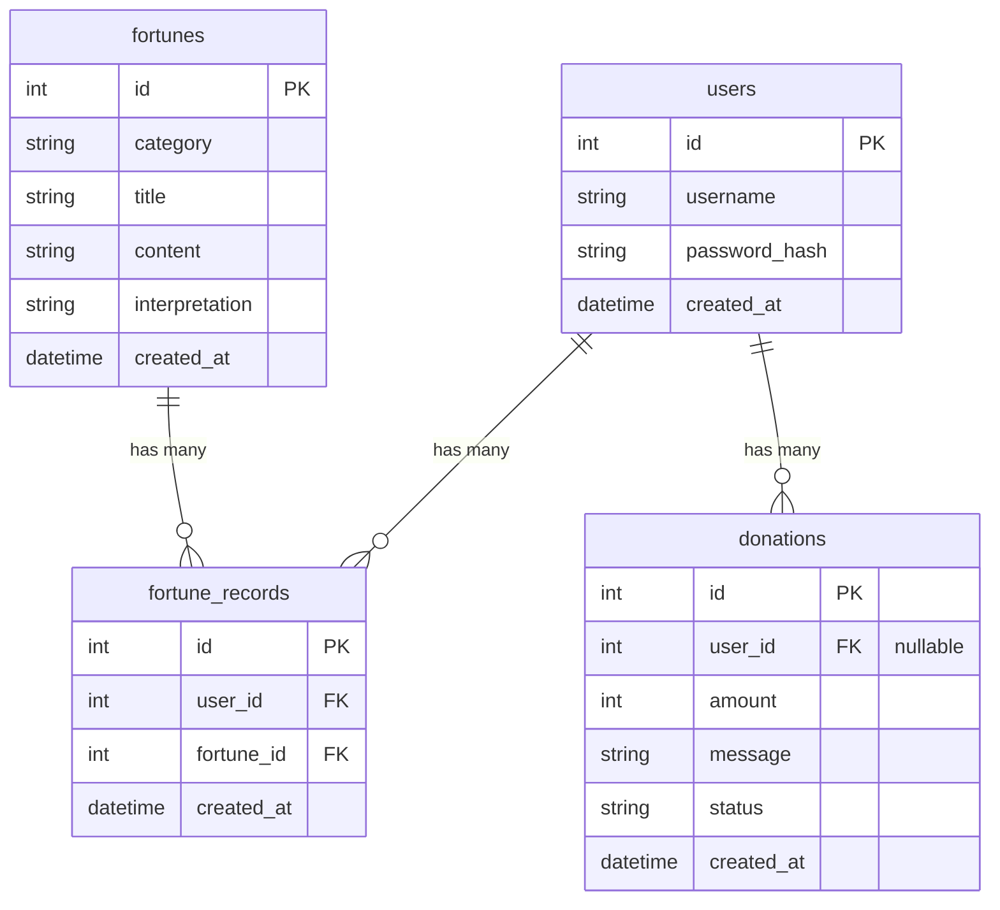

# 資料庫設計文件 (DB Design)

## 1. ER 圖（實體關係圖）

## 2. 資料表詳細說明

### `users` (會員資料表)
儲存使用者的登入資訊。
- `id` (INTEGER, PK): 會員唯一識別碼。
- `username` (TEXT, Not Null, Unique): 會員帳號名稱或 Email。
- `password_hash` (TEXT, Not Null): 經過雜湊加密處理的密碼。
- `created_at` (DATETIME, Not Null): 帳號建立時間，預設為 `CURRENT_TIMESTAMP`。

### `fortunes` (籤詩資料庫)
儲存系統中所有的籤詩或占卜結果選項（例如：觀音六十籤文字等）。
- `id` (INTEGER, PK): 籤詩唯一識別碼。
- `category` (TEXT, Not Null): 籤詩類別（例如：'觀音靈籤'、'塔羅牌'）。
- `title` (TEXT, Not Null): 籤詩名稱或編號（如：'第一籤 上上'）。
- `content` (TEXT, Not Null): 籤詩詳細文字內容。
- `interpretation` (TEXT): 解籤方向與建議。
- `created_at` (DATETIME, Not Null): 建立時間。

### `fortune_records` (使用者抽籤紀錄表)
紀錄使用者每一次的算命/抽籤歷史。
- `id` (INTEGER, PK): 紀錄唯一識別碼。
- `user_id` (INTEGER, FK, Not Null): 關聯至 `users` 表的 `id`。
- `fortune_id` (INTEGER, FK, Not Null): 關聯至 `fortunes` 表的 `id`，代表抽中了哪一張籤。
- `created_at` (DATETIME, Not Null): 抽籤當下的時間。

### `donations` (香油錢捐獻紀錄)
紀錄使用者的捐款（添香油錢）紀錄。
- `id` (INTEGER, PK): 訂單或捐款唯一識別碼。
- `user_id` (INTEGER, FK, Nullable): 若使用者已登入則紀錄 `user_id`，若未登入也可捐款（不綁定會員）。
- `amount` (INTEGER, Not Null): 捐獻金額。
- `message` (TEXT): 捐獻人留下的祈福或還願訊息。
- `status` (TEXT, Not Null): 交易狀態（'pending' 處理中, 'success' 成功, 'failed' 失敗），預設為 'pending'。
- `created_at` (DATETIME, Not Null): 訂單建立時間。

## 3. SQL 建表語法
完整的建表語法請參閱 `database/schema.sql`。

## 4. Python Model 程式碼
ORM 與基本資料庫操作皆建立於 `app/models/`，並實作 CRUD：
- `app/models/user.py`：會員 CRUD 取用
- `app/models/fortune.py`：籤詩存取 CRUD
- `app/models/fortune_record.py`：抽籤紀錄存取
- `app/models/donation.py`：香油錢機制存取
