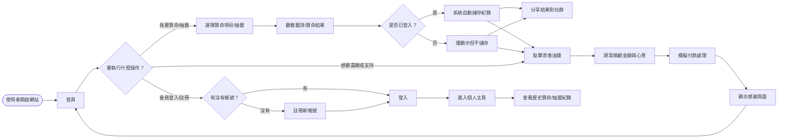
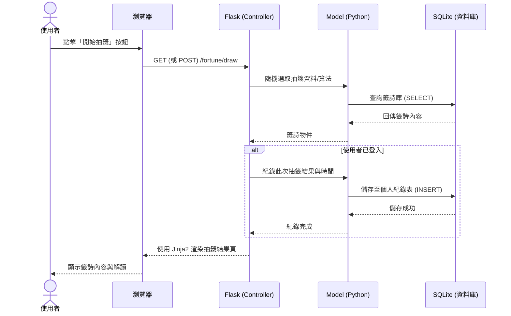

# 線上算命系統 - 流程圖 (Flowchart)

這份文件包含線上算命系統的**使用者流程圖**與核心功能的**系統序列圖**。本設計依據 PRD 與技術架構文件所列的功能需求構建，可以從此圖了解使用者如何在系統內操作，以及資料背後的流動方式。

## 1. 使用者流程圖 (User Flow)

這張圖展示了使用者進入網站後，可能經歷的各項操作路徑，涵蓋：算命/抽籤、註冊登入、查看歷史紀錄、模擬捐款以及結果分享。

## 2. 系統序列圖 (Sequence Diagram)

此序列圖描述了核心功能「使用者進行抽籤並儲存紀錄」一直到「資料存入 SQLite 資料庫並渲染畫面」的完整系統交互流程。

## 3. 功能清單對照表

以下為 MVP 階段規劃的核心功能，以及其對應的 URL 路徑與 HTTP 方法：

| 功能項目 | URL 路徑 | HTTP 方法 | 說明 |
| :--- | :--- | :--- | :--- |
| **首頁** | `/` | GET | 網站進入點，顯示介紹與主要功能入口。 |
| **註冊頁面** | `/auth/register` | GET, POST | 顯示註冊表單 (GET)，處理註冊邏輯 (POST)。 |
| **登入頁面** | `/auth/login` | GET, POST | 顯示登入表單 (GET)，處理驗證邏輯 (POST)。 |
| **登出處理** | `/auth/logout` | GET | 清除 Session 狀態並登出。 |
| **個人主頁** | `/profile` | GET | 顯示基本資料與過去所有的算命/抽籤歷史紀錄。 |
| **進行抽籤** | `/fortune/draw` | GET, POST | 執行抽籤或算命，並取得結果。 |
| **抽籤結果頁** | `/fortune/result/<id>` | GET | 單一結果的專屬頁面（方便直接分享）。 |
| **捐香油錢** | `/payment/donate` | GET | 顯示香油錢捐獻表單。 |
| **模擬付款** | `/payment/process` | POST | 接收表單並處理模擬付款邏輯，隨後導向成功頁面。 |
